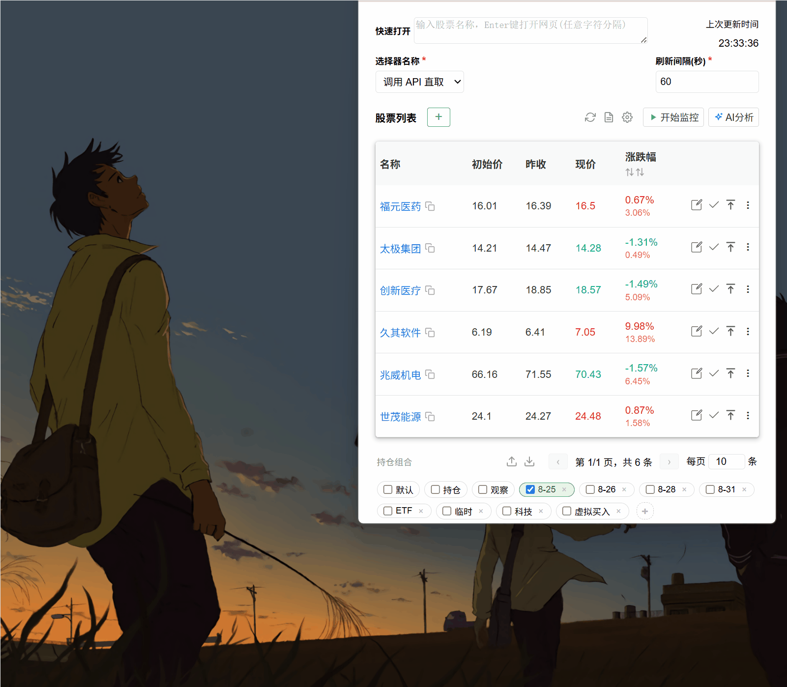
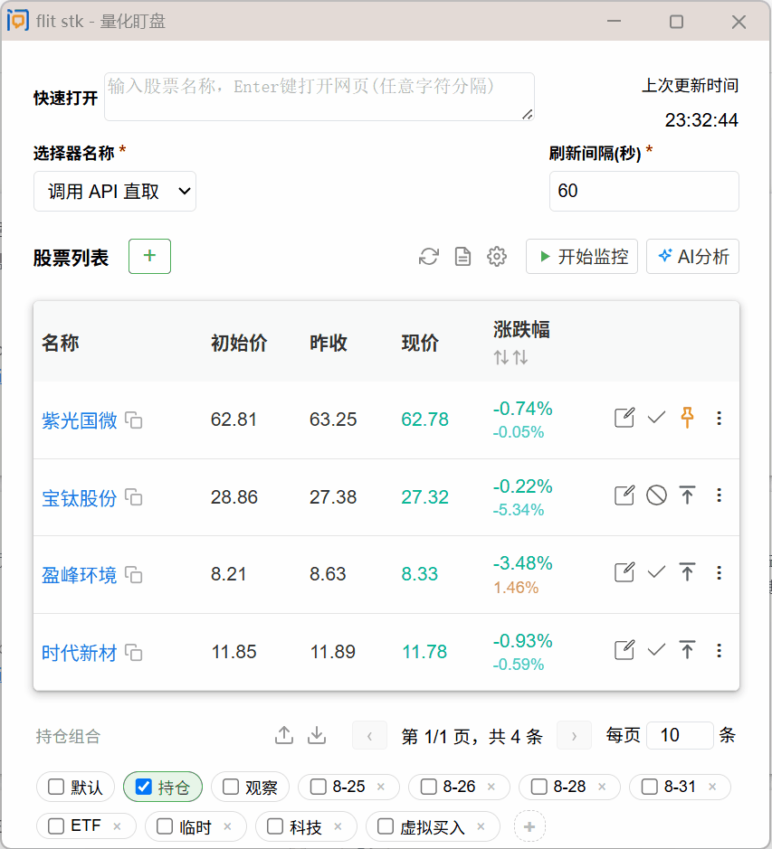

  <picture>
    <source media="(prefers-color-scheme: dark)" srcset="icons/icon128.png">
    
  </picture>

<h1 align="center">flit stk · 量化盯盘</h1>

  导入即用的无后端轻量级量化工作前台 · Chrome 扩展（Manifest V3） 
  <b>零服务端零配置</b> · 浏览器装好即用

  📌 <b>v1.9.0</b> · 本项目源于
  <a href="https://github.com/jcone211/web_auto_refresh">web_auto_refresh</a>，
  于 2026.8.29 迁移重构为全新项目，持续迭代中。
   
  ⭐ <b>觉得好用？点个 Star 支持持续更新！</b>

  
  
  

  <a href="#-最实用的量化功能">功能</a> ·
  <a href="#-快速开始">快速开始</a> ·
  <a href="#-快速实操">快速实操</a> ·
  <a href="#-详细文档">详细文档</a>

---

## ✨ 最实用的量化功能

| 功能                  | 说明                                                                                            |
| --------------------- | ----------------------------------------------------------------------------------------------- |
| **🤖 AI Agent 赋能**  | 自然语言提问操作股票、组合、要点，持久记忆偏好，多 API Key 配置，可结合小石大数据做量化扩展     |
| **📡 多渠道实时行情** | 集成 **adata 免费实时数据**、**小石大数据**、**问财 & 雪球页面爬取** 三种渠道，全局设置一键切换 |
| **📝 要点与事件记录** | 记录交易逻辑与预测事件，追踪准确率，分析结合实际动态调整策略                                    |
| **🔗 专业免费渠道**   | 批量打开问财/雪球看 K 线，一键批量导入到指定组合                                                |
| **⚙️ 全局可控**       | 按需启用/关闭各功能模块，不用的不占空间                                                         |
| **📦 一键迁移**       | 导出/导入完整数据，快速无缝迁移到其他设备                                                       |

 *AI 对话自然语言操作*

 *一键批量导入股票到组合*

## 🚀 快速开始

1. Chrome 打开 `chrome://extensions` → 开启**开发者模式** → 加载已解压的扩展 → 选择本项目目录
2. 顶部输入框输入股票名称/代码/URL 回车添加
3. 点击「开始监控」即可后台定时刷新，达到阈值自动弹出系统通知
4. 工具栏「✨ AI分析」打开对话窗口，右上角设置 API 地址和 Key，即可用自然语言操作一切

## ⚡ 快速实操（导入预置数据试玩）

项目自带一份预置导出数据，加载扩展后可一步导入体验完整功能：

1. 加载扩展后，点击页脚**导出按钮** → 选择「导入」
2. 选择项目目录下的 `thswc_full_backup_20260829-231116.json`
3. 导入完成即可看到预置的股票组合、要点事件等数据，直接开始监控查看效果

> ⚠️ AI 对话需自行配置大模型供应商（工具栏「✨ AI分析」→ 右上角「设置」→ 填写 Base URL / API Key / 模型），支持 DeepSeek / OpenAI / 阿里云百炼 Qwen / 本地 Ollama 等任何兼容端点。

## 📖 详细文档

详见 [README_old.md](README_old.md)（完整功能说明、架构、项目结构、注意事项）。