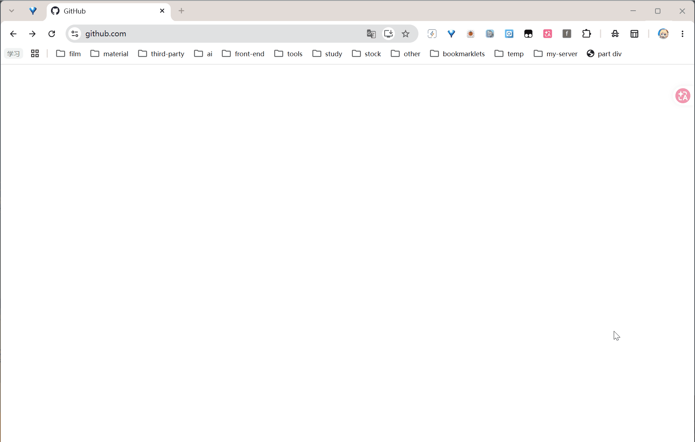
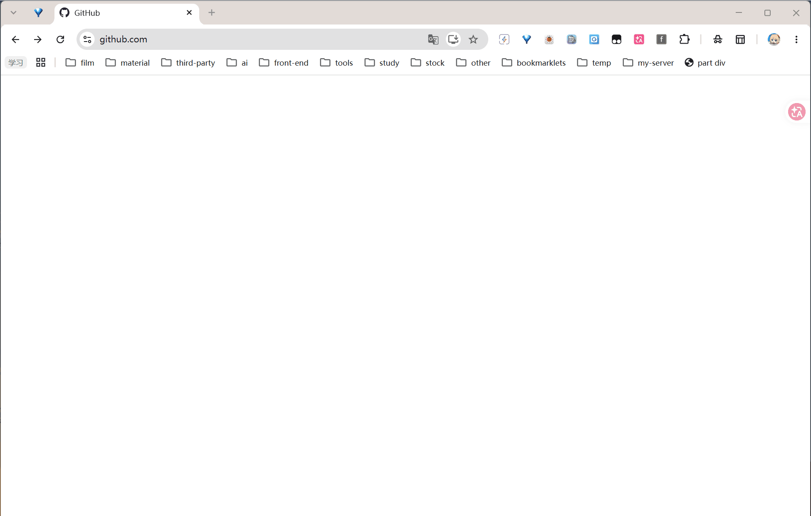
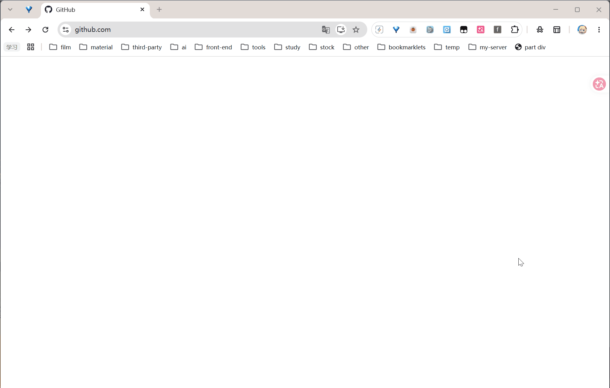
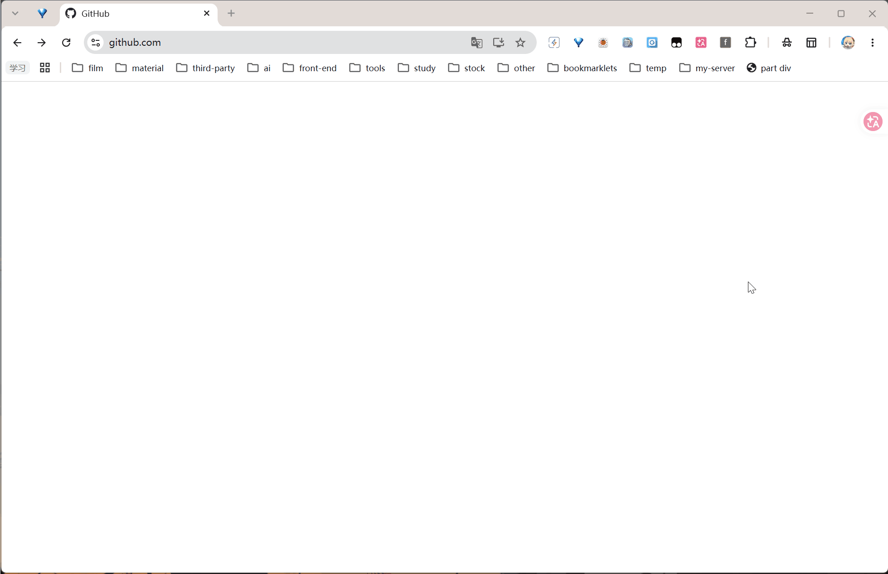

<p align="center">
  <picture>
    <source media="(prefers-color-scheme: dark)" srcset="icons/icon128.png">
    
  </picture>
</p>

<h1 align="center">flit stk · 量化盯盘</h1>

<p align="center">
  导入即用的无后端轻量级量化工作前台 · Chrome 扩展（Manifest V3）
</p>

<p align="center">
  <b>浏览器装好即用，零服务端零配置。</b><br><br>
  <b>你为什么需要 flit stk？</b><br>
  · 手机设置多个股价提醒麻烦，工作时切手机容易分心<br>
  · 股票分组不够灵活，多组股票管理操作繁琐<br>
  · 市场上稀缺的量化分析 AI Agent
    <b><br><br>受 DeepSeek Harness 架构启发</b><br>
  <i>沙箱隔离 · 输出拦截（Guard）· 轨迹日志 · 工作流复用 · 密钥全链路保护</i>
</p>

<p align="center">
  <b>v1.9.0</b> · 持续迭代中
</p>

<p align="center">
  <a href="https://github.com/jcone211/flit_stk/stargazers"></a>
  <a href="https://github.com/jcone211/flit_stk/network/members"></a>
  <a href="./LICENSE"></a>
</p>

<p align="center">
  <a href="#核心能力">功能</a> ·
  <a href="#架构一览与-deepseek-harness-类比">架构</a> ·
  <a href="#快速开始">快速开始</a> ·
  <a href="#快速实操导入预置数据试玩">快速实操</a> ·
  <a href="#详细文档">详细文档</a>
</p>

---

## 核心能力

| 功能               | 说明                                                                                                               |
| ------------------ | ------------------------------------------------------------------------------------------------------------------ |
| **AI Agent**       | 基于 **ReAct 范式**，零依赖 function-calling 循环，工具组冷加载，持久记忆偏好，多 API Key 配置，支持多本地工作目录 |
| **Agent桥接**      | 通过 **flit_bridge** 桥接本地 PostgreSQL 数据库，支持 AI Agent 执行脚本、查询日线、回测验证，零配置即可启用        |
| **多渠道实时行情** | 集成 **adata 免费实时数据**、**小石大数据**、**问财 & 雪球页面爬取** 三种渠道，全局设置一键切换                    |
| **多条件提醒**     | 分别按**当日涨跌幅**与**导入以来涨跌幅**设置阈值，实时监控并触发提醒                                               |
| **要点与事件记录** | 记录交易逻辑与预测事件，追踪准确率，分析结合实际动态调整策略                                                       |
| **专业免费渠道**   | 批量打开问财/雪球看 K 线，一键批量导入到指定组合                                                                   |
| **全局可控**       | 按需启用/关闭各功能模块，不用的不占空间                                                                            |
| **一键迁移**       | 导出/导入完整数据，快速无缝迁移到其他设备                                                                          |

---

## 架构一览（与 DeepSeek Harness 类比）

| flit_stk 对应层                                                                 | DeepSeek Harness 类比       | 关键差异                                                                       |
| ------------------------------------------------------------------------------- | --------------------------- | ------------------------------------------------------------------------------ |
| **flit_bridge**（`spawn`+白名单+只读SQL+无Shell+路径防护）                      | 沙箱隔离执行环境            | 日常文件读写不走 bridge，经 Chrome File System Access API 直通（用户手势授权） |
| **ai/core/ai_guard.js**（纯函数三态判定：放行/注解/丢弃）                       | 输出拦截（Guard）           | 只针对行情反编造，不覆盖通用内容                                               |
| **ai/core/ai_debug.js**（会话全程记录+容量上限+回放）                           | 轨迹日志                    | 完全一致                                                                       |
| **chrome.storage.sync** + `.gitignore` + 日志脱敏 + 提示词硬规则                | 密钥/凭证保护               | 多一层 Git 级别防护（自动忽略 `config.json`）                                  |
| **`flit/` 写约束**（文件只能写 `flit/` 下）+ 工作流自动发现（`flit/workflow/`） | 工作目录隔离 + 可复用工作流 | AI 只能写 `flit/`，读全目录但受 Chrome 授权管辖                                |

## 常规用法演示gif

 _快速打开K线图_

 _一键批量导入股票到组合_

 _Agent 快速分析股票k线_

 _Agent 与插件联动_

## 快速开始

1. 按键盘 `Win + R` 键，输入 `cmd` 并回车打开命令行；分开执行以下命令克隆项目到本地：

   ```bash
   cd /d D:
   git clone https://github.com/jcone211/flit_stk.git
   ```

2. Chrome 打开 `chrome://extensions` → 开启**开发者模式** → 加载未打包的扩展程序 → 选择本项目目录，如D:/flit_stk
3. 顶部输入框输入股票名称/代码/URL 回车打开对应选择器的网站，可点击「一键导入」加入股票到组合
4. 已默认设置盘中3分钟刷新一次，或手动点击「开始监控」定时刷新当前选中的组合，达到阈值自动弹出系统通知
5. 工具栏「AI分析」打开对话窗口，右上角设置 API 地址和 Key，即可用自然语言操作一切

## 快速实操（导入预置数据试玩）

项目自带一份预置导出数据，加载扩展后可一步导入体验完整功能：

1. 加载扩展后，点击页脚**导出按钮** → 选择「导入」
2. 选择项目目录下的 `thswc_full_backup_20260829-231116.json`
3. 导入完成即可看到预置的股票组合、要点事件等数据，直接开始监控查看效果

> 注意：AI 对话需自行配置大模型供应商（工具栏「AI分析」→ 右上角「设置」→ 填写 Base URL / API Key / 模型），支持 DeepSeek / OpenAI / 阿里云百炼 Qwen / 本地 Ollama 等任何兼容端点。

## 详细文档

- [API_CHANNELS.md](API_CHANNELS.md)——**行情 / 日线数据渠道清单**：取数优先级、时段口径（盘中为何会拼一根未收盘的当日 K 线）、各渠道批量能力与浏览器可用性（新浪在扩展页常被 CORS 拦、腾讯为主力免费源）、小石额度只在免费拿不到时才用，以及改完链路怎么一次性回归验证。
- [README_old.md](README_old.md)（完整功能说明、架构、项目结构、注意事项）。

## 更新插件方式

进入项目目录执行 `git pull`，然后在 Chrome 扩展程序页面找到本插件，点击右下角的「重新加载」。通常不会导致数据丢失，但仍建议提前导出全局数据作为备份。

---

## 项目溯源

> 本项目于 **2026 年 8 月**从个人项目 [web_auto_refresh](https://github.com/jcone211/web_auto_refresh) 独立抽离而来，原项目聚焦于通用网页自动刷新与股价监控通知能力。
